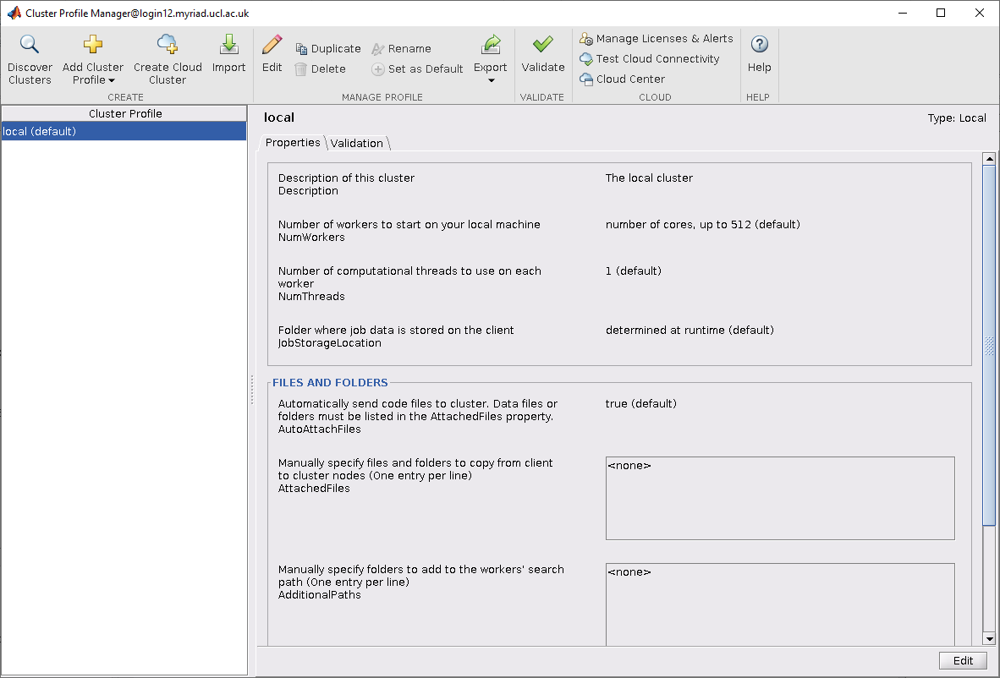
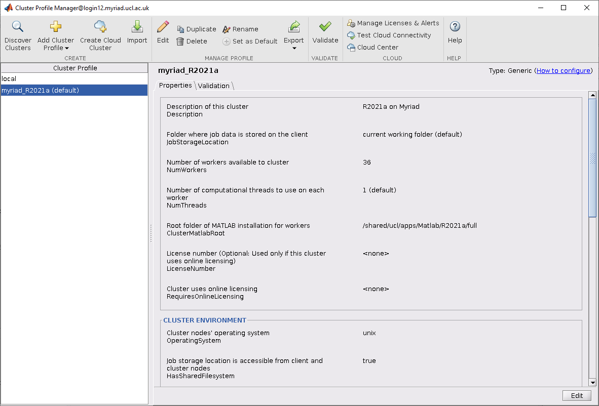

MATLAB is a numerical computing environment and proprietary programming language developed by MathWorks.

Our MATLAB installs include all the toolboxes included in UCL's Total Academic Headcount-Campus licence plus the MATLAB Parallel Server. We also have the NAG toolbox for Matlab available.

You can submit single node multi-threaded MATLAB jobs, single node
jobs which use the Parallel Computing Toolbox and the MATLAB Parallel
	Server (MPS) and MATLAB GPU jobs. Currently MATLAB jobs can only be run
	on Myriad however we are working with MathWorks to allow the
	submission of multi-node MPS jobs on Kathleen.


You can also submit jobs to Myriad from MATLAB running on your own desktop or laptop.

## Setup

You need to load MATLAB once from a login node before you can submit any jobs. This allows it to set up your `~/.matlab` directory as a symbolic link to `~/Scratch/.matlab` so that the compute nodes can write to it.

```
# on a login node
module load xorg-utils/X11R7.7
module load matlab/full/r2021a/9.10
``` 

We have other versions of MATLAB installed. You can run `module avail matlab` to see all the available installed versions.

## Single node multi-threaded batch jobs

This is the simplest way to start using MATLAB on the cluster.

You will need a .m file containing the MATLAB commands you want to carry out.

Here is an example jobscript which you would submit using the `qsub` command, after you have loaded the MATLAB module once on a login node as mentioned in [Setup](#setup):

```
#!/bin/bash -l

# Batch script to run a multi-threaded MATLAB job under SGE.

# Request ten minutes of wallclock time (format hours:minutes:seconds).
#$ -l h_rt=0:10:0

# Request 1 gigabyte of RAM per core. 
#$ -l mem=1G

# Request 15 gigabytes of TMPDIR space (default is 10 GB)
#$ -l tmpfs=15G

# Request a number of threads (which will use that number of cores). 
# On Myriad you can set the number of threads to a maximum of 36. 
#$ -pe smp 36

# Request one MATLAB licence - makes sure your job doesn't start 
# running until sufficient licenses are free.
#$ -l matlab=1

# Set the name of the job.
#$ -N Matlab_multiThreadedJob1

# Set the working directory to somewhere in your scratch space.
# This is a necessary step as compute nodes cannot write to $HOME.
# Replace "<your_UCL_id>" with your UCL user ID.
# This directory must already exist.
#$ -wd /home/<your_UCL_id>/Scratch/Matlab_examples

# Your work should be done in $TMPDIR
cd $TMPDIR

module load xorg-utils/X11R7.7
module load matlab/full/r2021a/9.10
# outputs the modules you have loaded
module list

# Optional: copy your script and any other files into $TMPDIR.
# This is only practical if you have a small number of files.
# If you do not copy them in, you must always refer to them using a
# full path so they can be found, eg. ~/Scratch/Matlab_examples/analyse.m

cp ~/Scratch/Matlab_examples/myMatlabJob.m $TMPDIR
cp ~/Scratch/Matlab_examples/initialise.m $TMPDIR
cp ~/Scratch/Matlab_examples/analyse.m $TMPDIR

# These echoes output what you are about to run
echo ""
echo "Running matlab -nosplash -nodisplay < myMatlabJob.m ..."
echo ""

matlab -nosplash -nodesktop -nodisplay < myMatlabJob.m
# Or if you did not copy your files:
# matlab -nosplash -nodesktop -nodisplay < ~/Scratch/Matlab_examples/myMatlabJob.m

# tar up all contents of $TMPDIR back into your space
tar zcvf $HOME/Scratch/Matlab_examples/files_from_job_${JOB_ID}.tgz $TMPDIR

# Make sure you have given enough time for the copy to complete!
```

Alternative syntax:
Instead of using Unix input redirection like this:
```
matlab -nosplash -nodesktop -nodisplay < $Matlab_infile
```
you can also do:
```
matlab -nosplash -nodesktop -nodisplay -r $Matlab_infile
```

**NOTE:** You should use the `-r` syntax if your input file contains function definitions as using `<` treats the script as keyboard input and MATLAB does not allow you to define functions directly on the command line.

### Run without the JVM to reduce overhead

You can give the `-nojvm` option to tell MATLAB to run without the Java Virtual Machine. This will speed up startup time, possibly execution time, and remove some memory overhead, but will prevent you using any tools that require Java (eg, tools that use the Java API for I/O and networking like URLREAD, or call Java object methods). 

### Run single-threaded

Most of the time, MATLAB will create many threads and use them as it wishes. If you know your job is entirely single-threaded, you can force MATLAB to run with only one thread on one core, which will allow you to have more jobs running at once. 

To request one core only, set `#$ -pe smp 1` in your jobscript.

Run MATLAB like this:
```
matlab -nosplash -nodesktop -nodisplay -nojvm -singleCompThread < $Matlab_infile
```

The `-singleCompThread` forces MATLAB to run single-threaded, and the `-nojvm` tells it to run without the Java Virtual Machine, as above. 

## Using the MATLAB GUI interactively

You can run MATLAB interactively for short amounts of time on the login nodes (please do not do this if your work will be resource-intensive). You can also run it interactively in a `qrsh` session on the compute nodes.

Launching with `matlab` will give you the full graphical user interface - you will need to have logged in to the cluster with X-forwarding on for this to work. 

Launching with `matlab -nodesktop -nodisplay` will give you the MATLAB terminal.


## Submitting jobs using the MATLAB Parallel Server (MPS)

You must have loaded the MATLAB module once from a login node as described in [Setup](#setup) before you can submit any MATLAB MPS jobs.

MATLAB PCS jobs must be submitted from an interactive or scripted
Matlab session which can be running on the cluster login nodes, from
another MATLAB job or [on your own machine](#submitting-matlab-jobs-from-your-workstationlaptop).

MATLAB MPS jobs will currently only work inside a single node on our
clusters. On Myriad this means a maximum of 36 workers can be used per
job.

### Importing the cluster profile

You need to import the cluster profile into your MATLAB environment and set it as the default before you can submit DCS jobs. This only needs doing once. The imported profile will be saved in your MATLAB settings directory.

Importing the profile can be done either by calling MATLAB functions or via the graphical interface. The profile is stored here (for R2021a): 
```
/shared/ucl/apps/Matlab/toolbox_local/R2021a/myriad_R2021a.mlsettings
```

#### Import using MATLAB functions

Run these functions from a MATLAB session:
```
profile_Myriad = parallel.importProfile ('/shared/ucl/apps/Matlab/toolbox_local/R2021a/myriad_R2021a.mlsettings');
parallel.defaultClusterProfile ('myriad_R2021a');
```

#### Import from MATLAB GUI

To import using the graphical interface instead, do this.

1. From the Home tab select the Parallel menu and click _Create and Manage Clusters..._.
2. The Cluster Profile Manager window will open.

3. Select Import and in the _Import Profiles from file_ window navigate to the myriad_R2021a.mlsettings file shown above and select Open.
4. Select the resulting myriad_R2021a profile and click _Set as Default_. The Cluster Profile Manager window should now look like this:


In both cases after you exit MATLAB your cluster profile is saved for future use.

#### Environment variables needed for job submission

We have set up four Grid Engine environment variables to assist with job submission from within MATLAB. These are needed to pass in job resource parameters that aren't supported by the internal MATLAB job submission mechanism.

* `SGE_CONTEXT`: a comma-separated list of variables treated as if added via the `-ac` option, eg. `exclusive`
* `SGE_OPT`: a comma-separated list of resources treated as if added via the `-l` option, eg. `h_rt=0:10:0,mem=1G,tmpfs=15G`

and two project and Gold related variables. Most users will not need to use either of these:

* `SGE_PROJECT`: a project treated as if added via the `-P` option.
* `SGE_ACCOUNT`: a Gold project as if added via the `-A` option. When using this your `SGE_PROJECT` needs to be set to `Gold`.

`-ac exclusive` prevents anything else running on the same node as your job, even if you aren't using all the cores. This is no longer a necessary option for MATLAB jobs.

There are two ways to set these:

1) Before starting your MATLAB session, using the usual Bash method of exporting environment variables:
```
export SGE_CONTEXT=exclusive
export SGE_OPT=h_rt=0:15:0,mem=2G,tmpfs=15G
export SGE_PROJECT=<your project ID>
export SGE_ACCOUNT=<your Gold project>
```

2) Inside your MATLAB session, using MATLAB's `setenv` function:
```
setenv ('SGE_CONTEXT', 'exclusive');
setenv ('SGE_OPT', 'h_rt=0:15:0,mem=2G,tmpfs=15G'); 
setenv ('SGE_PROJECT', '<your project ID>');
setenv ('SGE_ACCOUNT', '<your Gold project>');
```

#### Example: a simple MPS job

This submits a job from inside a MATLAB session running on a login node. You need to start MATLAB from a directory in Scratch - jobs will inherit this as their working directory.

This is an example where you have only one MATLAB source file.

1) Change to the directory in Scratch you want the job to run from and set the SGE environment variables.
```
cd ~/Scratch/Matlab_examples
export SGE_OPT=h_rt=0:10:0,mem=2G,tmpfs=15G
```

2) Either start the MATLAB GUI:
```
matlab
```
or start a MATLAB terminal session:
```
matlab -nodesktop -nodisplay
```

3) Inside MATLAB, create a cluster object using the cluster profile:
```
c = parcluster ('myriad_R2021a');
```

4) Use your cluster object to create a job object of the type you need. For this example the job is a parallel job with communication between MATLAB workers of type "Single Program Multiple Data":
```
myJob = createCommunicatingJob (c, 'Type', 'SPMD');
```

5) Set the number of workers:
```
num_workers = 8;
```
The maximum value you can set here on Myriad is 36.

6) Tell the job the files needed to be made available to each worker - in this example there is only one file:
```
myJob.AttachedFiles = {'colsum.m'};
```
`colsum.m` contains the simple magic square example from the MATLAB manual "Parallel Computing Toolbox User's Guide". 

7) Set the minimum and maximum number of workers for the job (we are asking for an exact number here by setting them the same):
```
myJob.NumWorkersRange = [num_workers, num_workers];
```

8) Create a MATLAB task to be executed as part of the job. Here it consists of executing the MATLAB function `colsum`. The other arguments say that the task returns one parameter and there are no input arguments to the `colsum` function:
```
task = createTask (myJob, @colsum, 1, {});
```

9) Submit the job:
```
submit (myJob);
```
Your job is now submitted to the scheduler and you can see its queue status in `qstat` as normal. If you were using the MATLAB GUI you can also monitor jobs by selecting _Monitor Jobs_ from the _Parallel_ menu on the _Home_ tab.

10) When the job has completed get the results using:
```
results = fetchOutputs(myJob)
```
You can access the job log from MATLAB using:
```
logMess = getDebugLog (c, myJob);
```


#### Example: a MPS job with more than one input file

This example has several input files. The job type is "MATLAB Pool". A "Pool" job runs the specified task function with a MATLAB pool available to run the body of parfor loops or spmd blocks and is the default job type. This example was kindly supplied to assist in testing MATLAB by colleagues from CoMPLEX. 

The first part of creating the job is the same as the above example apart from the longer runtime and larger amount of memory per core: 

1)  Change into a directory in Scratch, set the SGE variables and launch MATLAB:
```
cd ~/Scratch/Matlab_examples
export SGE_OPT=h_rt=1:0:0,mem=4G,tmpfs=15G
matlab
```
to launch the GUI or:
```
matlab -nodesktop -nodisplay
```
to start a terminal session. 
```
c = parcluster ('myriad_R2021a');
```

2) Using our cluster object create a job object of type "Pool":
```
myJob2 = createCommunicatingJob (c, 'Type', 'Pool');
```

3) Set the number of workers and another variable used by the example:
```
num_workers = 8;
simulation_duration_ms = 1000;
```

4) Tell the job all the input files needed to be made available to each worker as a cell array:
```
myJob2.AttachedFiles = {
'AssemblyFiniteDifferencesMatrix.m'
'AssemblyFiniteDifferencesRightHandSide.m'
'CellModelsComputeIonicCurrents.m'
'CellModelsGetVoltage.m'
'CellModelsInitialise.m'
'CellModelsSetVoltage.m'
'GetStimuliForTimeStep.m'
'SubmitMonodomainJob.m'
'RegressionTest.m'
'RunAndVisualiseMonodomainSimulation.m'
'SolveLinearSystem.m'
'luo_rudy_1991_iionic.m'
'luo_rudy_1991_time_deriv.m'};
```

5) Set the minimum and maximum number of workers for the job:
```
myJob2.NumWorkersRange = [num_workers, num_workers];
```

6) Create a MATLAB task to be executed as part of the job. For this example it will consist of executing the MATLAB function `RunAndVisualiseMonodomainSimulation`. The rest of the arguments indicate that the task returns three parameters and there are five input arguments to the function. These are passed as a cell array:
```
task = createTask (myJob2, @RunAndVisualiseMonodomainSimulation, 3, {5000, simulation_duration_ms, 1.4, 1.4, false});
```
7) Submit the job:
```
submit (myJob2);
```

As before use `fetchOutputs` to collect the results.

If you closed your session, you can get your results by:
```
c = parcluster ('myriad_R2021a');                  # get a cluster object
jobs = findJob(c)                                  # get a list of jobs submitted to that cluster
job = jobs(3);                                     # pick a particular job
results = fetchOutputs(job)
```
You can get other information: `diary(job)` will give you the job diary, and `load(job)` will load the workspace. 

#### Further reading

There is a lot more information about using the MATLAB Distributed Computing Server in the MATLAB manual: [Parallel Computing Toolbox User’s Guide](https://uk.mathworks.com/help/parallel-computing/index.html).


## Submitting MATLAB jobs from your workstation/laptop

You can submit MATLAB jobs to Myriad from MATLAB sessions running on your own desktop workstation or laptop systems provided they are running the same version of MATLAB and your computer is within the UCL firewall. 

With MATLAB R2021a you can currently submit jobs to Myriad. Support for R2018b is also still available. 

### Prerequisites

1. You must already have an account on the clusters!
2. Have MATLAB R2021a (or R2018b) installed on your local workstation/laptop. The local version must match the version running jobs. MATLAB R2021a can be downloaded from the [UCL Software Database](http://swdb.ucl.ac.uk/package/view/id/2?filter=Matlab).
3. Your local workstation/laptop installation of MATLAB must include the Parallel Computing toolbox. This is included in the UCL TAH MATLAB license and may be installed automatically.
 Home tab > Add-Ons > Get Add-Ons
 You will find the Parallel Computing Toolbox in the Workflows category.
4. If your local workstation/laptop is not directly connected to the UCL network (at home for example), you need to have the [UCL VPN client](https://www.ucl.ac.uk/isd/services/get-connected/remote-working-services/ucl-virtual-private-network-vpn) installed and running on it.

### Remote setup

1) On the cluster you are using (Myriad in this case) create a directory to hold remotely submitted job details. For example:
```
mkdir ~/Scratch/Matlab_remote_jobs
```
This directory needs to be in your Scratch directory as compute nodes need to be able to write to it. You should not use this directory for anything else.

2) On your local workstation/laptop create a directory to hold information about jobs that have been submitted to the cluster. Again you should not use this directory for anything else.

3) Download either the the [support files for remote submission to Myriad for R2021a](matlab_resources/Myriad_submit_R2021a.zip) or [support files for remote submission to Myriad for R2018b](matlab_resources/Myriad_submit_R2018b.zip). Make sure you download the correct one for your version of MATLAB!

4) This step **MUST** be done while Matlab is shut down. Unzip the archive into MATLAB's local toolbox directory. Default locations for the local toolbox directory are:

* Linux:
The default local toolbox location is `/usr/local/MATLAB/R2021a/toolbox/local` for R2021a. Navigate to this directory and use `unzip -x archive_name`. 
* macOS:
The default local toolbox location is `/Applications/MATLAB_R2021a.app/toolbox/local` for R2021a. In order to view or change the contents of an application package, open `/Applications` in a Finder window. Then right-click the application and select "View Package Contents." Then navigate to the appropriate directory. Note: if you don't have access to `/Applications/MATLAB_R2021a.app/toolbox/local`, you can unzip the support files into `~/Documents/MATLAB/` instead. 
* Windows:
The default local toolbox location is `C:\Program Files\MATLAB\R2021a\toolbox\local` for R2021a. Extract the archive here. You can unzip the support files into `Documents\MATLAB\` instead.

5) Download the [parallelProfileMyriad function](matlab_resources/parallelProfileMyriad.m)  to your local workstation/laptop. It will need to be unzipped. This function create a cluster profile for Myriad for R2021a or R2018b.

6) Start MATLAB, navigate to where you saved the `parallelProfileMyriad.m` file and run the function by typing:
```
parallelProfileMyriad
```

at your MATLAB prompt (in your MATLAB Command Window if running the MATLAB GUI) and answer the questions.

### Submitting a job to the cluster


1) You need to set the [Grid Engine support environment variables](#environment-variables-needed-for-job-submission) on your local computer.
Eg. in your MATLAB session set:
```
setenv ('SGE_CONTEXT', 'exclusive');                # optional
setenv ('SGE_OPT', 'h_rt=0:15:0,mem=2G,tmpfs=15G'); 
setenv ('SGE_PROJECT', '<your project ID>');        # optional
setenv ('SGE_ACCOUNT', '<your Gold project>');      # optional
```

2) In your MATLAB session create a cluster object using the cluster profile created by the `parallelProfile...` functions. For Myriad:
```
c = parcluster ('myriad_R2021a');
```


3) You can now create and submit jobs in a similar way to that shown in the MPS examples above starting from step 4 in the [simple MPS job example](#example-a-simple-mps-job) or step 2 in the [MPS job with multiple input files example](#example-a-mps-job-with-more-than-one-input-file).


### Viewing your results

After submitting your job remotely from your desktop, you can close MATLAB and come back later. To see your jobs:

Click "Parallel > Monitor jobs"

This will bring up the job monitor where you can see the status of your jobs and whether they are finished. MATLAB numbers the jobs sequentially.

Right-click on a job and choose "fetch outputs".

This is what will be executed (for job4 on Myriad):
```
myCluster = parcluster('myriad_R2021a');
job4 = myCluster.findJob('ID',4);
job4_output = fetchOutputs(job4);
```

The Workspace will show the available data and you can view your results. The data is fetched from the `Matlab_remote_jobs` directory you created on Myriad (or Legion) in [Remote setup](#remote-setup) step 1, so that will also have files and directories in it called job1, job2 and so on.

If you have already fetched the data, you can view the results straight away by selecting that job. If you need to reload everything, you can right-click on the job and the option will be to load variables instead. 

#### Writing intermediate results

If you want to explicitly write out intermediate results, you need to provide a full path to somewhere in Scratch otherwise MATLAB will try to write them in your home, which isn't writable by the compute nodes. 


### Troubleshooting remote jobs

If you get a message like this when retrieving your outputs then something has gone wrong in your job:
```
Task with ID xxx returned 0 outputs but 1 were expected
```
You need to retrieve the debug log to find out what happened. Example:
```
myCluster = parcluster('myriad_R2021a');
job4 = myCluster.findJob('ID',4);

jobLog = getDebugLog (myCluster, job4);
jobLog
```
There will be a lot of output. Look for lines related to errors happening in your own code.


## Running MATLAB on GPUs

This uses MATLAB's [Mandelbrot Set GPU example](https://uk.mathworks.com/help/parallel-computing/illustrating-three-approaches-to-gpu-computing-the-mandelbrot-set.html).

```
#!/bin/bash -l

# Batch script to run a GPU MATLAB job on Myriad.

# Request 15 minutes of wallclock time (format hours:minutes:seconds).
#$ -l h_rt=0:15:0

# Request 2 gigabytes of RAM per core.
#$ -l mem=2G

# Request 15 gigabytes of TMPDIR space (default is 10 GB)
#$ -l tmpfs=15G

# Request 1 GPU
#$ -l gpu=1

# Request 1 CPU core. (Max on Myriad is 36)
#$ -pe smp 1

# Request one MATLAB licence - makes sure your job doesn't start 
# running until sufficient licenses are free.
#$ -l matlab=1

# Set the name of the job.
#$ -N Matlab_GPU_Job1

# Set the working directory to somewhere in your scratch space.
# This is a necessary step as compute nodes cannot write to $HOME.
# Replace "<your_UCL_id>" with your UCL user ID.
# This directory must already exist.
#$ -wd /home/<your_UCL_id>/Scratch/Matlab_examples

# Your work should be done in $TMPDIR
cd $TMPDIR

# Optional: Copy your script and any other files into $TMPDIR.
# If not, you must always refer to them using a full path.
cp /home/ccaabaa/Software/Matlab/Mandelbrot_GPU.m $TMPDIR

module unload compilers mpi
module load compilers/gnu/4.9.2
module load xorg-utils/X11R7.7
module load matlab/full/r2021a/9.10
module list

# These echoes output what you are about to run
echo ""
echo "Running matlab -nosplash -nodisplay < Mandelbrot_GPU.m ..."
echo ""
matlab -nosplash -nodesktop -nodisplay < Mandelbrot_GPU.m

# tar up all contents of $TMPDIR back into your space
tar zcvf $HOME/Scratch/Matlab_examples/files_from_job_${JOB_ID}.tgz $TMPDIR

# Make sure you have given enough time for the copy to complete!
```
