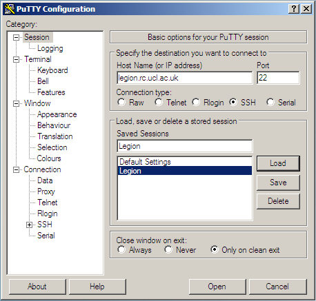

# How do I?

I have an account, now:

## How do I log in?

Logging in is most straightforward if you are inside the UCL firewall. If you are logging in from home or other external networks then you first have to [get on to the UCL network](#logging-in-from-outside-the-ucl-firewall).

### Linux / Unix / Mac OS X

Use the terminal and type the below command to secure shell (ssh) into the machine you wish to access. Replace `<your_UCL_user_id>` with your central UCL username, and `<system_name>` with the name of the machine you want to log in to, eg. `legion`, `grace`, `aristotle`. 

```
ssh <your_UCL_user_id>@<system_name>.rc.ucl.ac.uk
```

### Windows

On Windows you need something that will give you a suitable terminal and ssh - usually PuTTY, although you could also use Cygwin if you wanted a full Linux-like environment.

#### Using PuTTY

PuTTY is a common SSH client on Windows and is available on Desktop@UCL. You can find it under `Start > All Programs > Applications O-P > PuTTY`

You will need to create an entry for the host you are connecting to with the settings below. If you want to save your settings, give them an easily-identifiable name in the "Saved Sessions" box and press "Save". Then you can select it and "Load" next time you use PuTTY. 



In newer versions of PuTTY, it looks like this.

*TODO: new putty*

You will then be asked to enter your username and password. Only enter your username, not `@legion.rc.ucl.ac.uk`. The password field will remain entirely blank when you type in to it - it does not show placeholders to indicate you have typed something. 

### Logging in from outside the UCL firewall

You will need to either use the [UCL Virtual Private Network](http://www.ucl.ac.uk/isd/staff/network/vpn) or ssh in to UCL's gateway `socrates.ucl.ac.uk` first. From Socrates you can then ssh in to our systems by typing `ssh <your_UCL_user_id>@<system_name>.rc.ucl.ac.uk`. 

**Advanced:** If you find you need to go via Socrates often, you can set up this jump automatically, see [Single-step logins using tunnelling](#single-step-logins-using-tunnelling)


### Login problems

If you experience difficulties with your login, please make sure that you are typing your UCL user ID and your password correctly. If you have recently updated your password, it takes some hours to propagate to all UCL systems.

If you still cannot get access but can access other UCL services like Socrates, please contact us on rc-support@ucl.ac.uk. Your account may have expired, or you may have gone over quota.

If you cannot access anything, please see UCL MyAccount - you may need to request a password reset from the Service Desk. 

If you get a host key error message, you will need to delete old host keys. *TODO: details*


## How do I transfer data onto the system?

You can transfer data to and from our systems using any program capable of using the Secure Copy (SCP) protocol. This uses the same SSH system as you use to log in to a command line session, but then transfers data over it. This means that if you can use SSH to connect to a system, you can usually use SCP to transfer files to it. 

### Copying files using Linux or Mac OS X

You can use the command-line utilities scp, sftp or rsync to copy your data about. You can also use a graphical client (Transmit, CyberDuck, FileZilla).

#### scp

This will copy a data file from somewhere on your local machine to a specified location on the remote machine (Legion, Grace etc).

```
scp <local_data_file> <remote_user_id>@<remote_hostname>:<remote_path>
```
```
# Example: copy myfile from your local current directory into Scratch on Legion
scp myfile ccxxxxx@legion.rc.ucl.ac.uk:~/Scratch/
```

This will do the reverse, copying from the remote machine to your local machine. (This is still run from your local machine).

```
scp <remote_user_id>@<remote_hostname>:<remote_path><remote_data_file> <local_path>
```
```
# Example: copy myfile from Legion into the Backups directory in your local current directory
scp ccxxxxx@legion.rc.ucl.ac.uk:~/Scratch/myfile Backups/
```

#### sftp

You can use sftp to log in to the remote machine, navigate through directories and use `put` and `get` to copy files from and to your local machine. `lcd` and `lls` are local equivalents of `cd` and `ls` so you can navigate through your local directories as you go. 

```
sftp <remote_user_id>@<remote_hostname>
cd <remote_path>
get <remote_file>
lcd <local_path>
put <local_file>
```
```
# Example: download a copy of file1 into your local current directory,
# change local directory and upload a copy of file2
sftp ccxxxxx@legion.rc.ucl.ac.uk
cd Scratch/files
get file1
lcd ../files_to_upload
put file2
```

#### rsync

Rsync is used to remotely synchronise directories, so can be used to only copy files which have changed. Have a look at `man rsync` as there are many options. 

### Copying files using Windows and WinSCP

WinSCP is a graphical client that you can use for scp or sftp.

 1. The login/create new session screen will open if this is the first time you are using WinSCP.
 2. You can choose SFTP or SCP as the file protocol. If you have an unstable connection with one, you may wish to try the other. SCP is probably generally better.
 3. Fill in the hostname of the machine you wish to connect to, your username and password.
 4. Click Save and give your settings a useful name.
 5. You'll then be shown your list of Stored sessions, which will have the one you just created.
 6. Select the session and click Login.

### Transferring files from outside the UCL firewall

As when logging in, when you are outside the UCL firewall you will need a method to connect inside it before you copy files. (You do not want to be copying files on to Socrates and then on to our systems - this is slow, unnecessary, and it means you need space available on Socrates too).

You can use the [UCL Virtual Private Network](http://www.ucl.ac.uk/isd/staff/network/vpn) and scp direct to our systems or you can do some form of ssh tunnelling.


### Single-step logins using tunnelling

#### Linux / Unix / Mac OS X

Inside your `~/.ssh` directory on your local machine, add the below to your `config` file (or create a file called `config` if you don't already have one).

Generically, it should be of this form where `<name>` can be anything you want to call this entry.

```
Host <name>
   User <remote_user_id>
   HostName <remote_hostname>
   proxyCommand ssh -W <remote_hostname>:22 <remote_user_id>@socrates.ucl.ac.uk
```
This causes the commands you type in your client to be forwarded on over a secure channel to the specified remote host.

Here are some examples - you can have as many of these as you need in your config file.
```
Host legion
   User ccxxxxx
   HostName legion.rc.ucl.ac.uk
   proxyCommand ssh -W legion.rc.ucl.ac.uk:22 ccxxxxx@socrates.ucl.ac.uk

Host login05
   User ccxxxxx
   HostName login05.external.legion.ucl.ac.uk
   proxyCommand ssh -W login05.external.legion.ucl.ac.uk:22 ccxxxxx@socrates.ucl.ac.uk

Host aristotle
   User ccxxxxx
   HostName aristotle.rc.ucl.ac.uk
   proxyCommand ssh -W aristotle.rc.ucl.ac.uk:22 ccxxxxx@socrates.ucl.ac.uk
```

You can now just type `ssh legion` or `scp file1 aristotle:~` and you will go through Socrates. You'll be asked for login details twice since you're logging in to two machines, Socrates and your endpoint.  

#### Windows

WinSCP can also set up SSH tunnels.

 1. Create a new session as before, and tick the Advanced options box in the bottom left corner.
 2. Select Connection > Tunnel from the left pane.
 3. Tick the Connect through SSH tunnel box and enter the hostname of the gateway you are tunnelling through, for example socrates.ucl.ac.uk
 4. Fill in your username and password for that host. (Central UCL ones for Socrates).
 5. Select Session from the left pane and fill in the hostname you want to end up on after the tunnel.
 6. Fill in your username and password for that host and set the file protocol to SCP.
 7. Save your settings with a useful name.

### Managing your quota


## How do I submit a job to the scheduler?


## How do I monitor a job?


## How do I run a graphical program?
